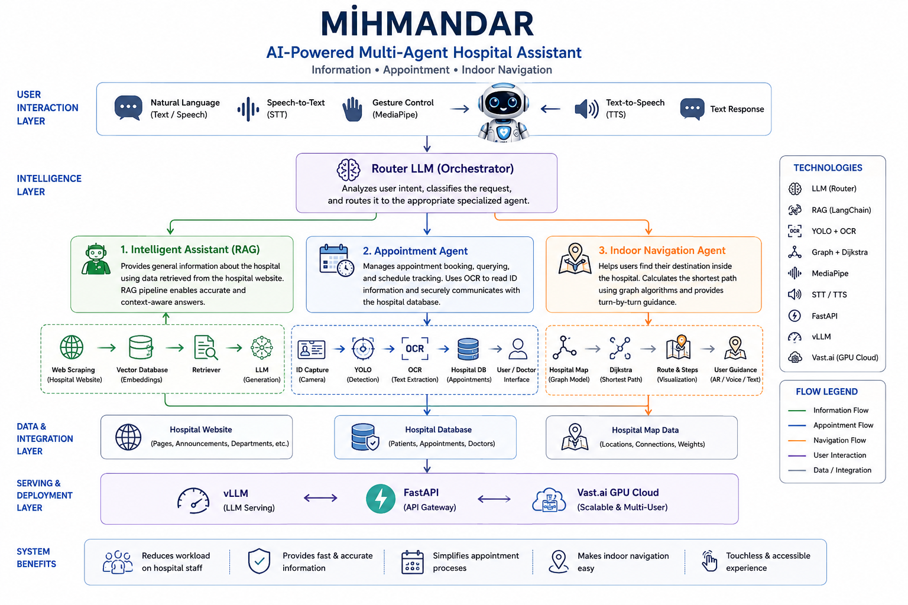

# MİHMANDAR  
### Smart Hospital Assistant for Patient Guidance, Communication, and Navigation

MİHMANDAR is an AI-driven hospital assistant system designed to reduce operational load on hospital staff and improve patient experience by providing intelligent guidance, appointment management, and indoor navigation through natural language interaction.

The name "MİHMANDAR" originates from Old Turkish, meaning *"the one who welcomes and guides guests"*, reflecting the core purpose of the system.

---

## 🎯 Problem Definition

Modern hospitals face a high volume of repetitive patient inquiries such as:

- "Where can I give blood?"
- "How do I book an appointment?"
- "Where is the cardiology department?"

These repetitive questions increase workload on medical staff and reduce operational efficiency.

MİHMANDAR is designed to solve this by providing a unified intelligent assistant that handles information, workflow, and navigation tasks.

---

## 🧠 System Overview

The system is built on a **multi-agent architecture** controlled by a **Router LLM**, which dynamically routes user queries to specialized agents.

### Core Idea:
A single intelligent interface → multiple specialized AI agents.

---

## 🏗️ System Architecture

  

---

## 🤖 Agents

### 1. Intelligent Information Agent (RAG-based)
- Provides hospital-related general information
- Uses web-scraped hospital data
- Retrieval-Augmented Generation (RAG) pipeline
- Optimized for natural language Q&A

---

### 2. Appointment Management Agent
- Connected to hospital database
- Users can:
  - Book appointments
  - Query existing appointments
- Doctors can view daily schedules
- Supports OCR-based ID extraction (YOLO + OCR pipeline)

---

### 3. Indoor Navigation Agent
- Graph-based hospital layout model
- Uses **Dijkstra’s algorithm** for shortest path computation
- Provides step-by-step indoor routing guidance

---

## ⚙️ Supporting Technologies

### 🧭 Router LLM
Central decision-making component that classifies user intent and routes requests to the correct agent.

---

### 📚 RAG Pipeline
Used in the Intelligent Information Agent to enrich LLM responses with hospital-specific knowledge.

---

### 👁️ YOLO + OCR
- Extracts patient identity information from ID cards
- Eliminates manual form filling
- Improves usability and speed

---

### 🗺️ Graph-Based Navigation
- Hospital layout modeled as a weighted graph
- Shortest path computed using Dijkstra algorithm

---

### ☁️ LLM Serving Infrastructure
- Models deployed on rented GPU infrastructure (Vast.ai)
- Served via **vLLM**
- Exposed through **FastAPI**
- Supports multi-user access

---

### 🖐️ Human Interaction Layer
- **MediaPipe**: gesture-based activation (e.g., hand wave)
- **STT (Speech-to-Text)**: voice input support
- **TTS (Text-to-Speech)**: voice response system
- Enables fully contactless hospital interaction

---

## 🧩 System Capabilities

- Multi-agent AI orchestration
- Natural language hospital assistance
- Automated appointment handling
- Indoor navigation system
- Contactless interaction (gesture + voice)
- Real-time LLM inference via API

---

## 🎥 Demo

A full system demonstration video is available here:

  

---

## 📄 Presentation

Detailed project presentation:

👉 [Project Presentation PDF](assets/mihmandar_presentation.pdf)

---

## 💡 Key Innovations

- Multi-agent LLM orchestration using Router architecture
- Hybrid system combining RAG, OCR, Graph algorithms, and LLMs
- Contactless hospital interaction (gesture + speech)
- End-to-end AI system deployed on cloud GPU infrastructure

---

## 🚀 Future Work

- Integration with real hospital information systems (HIS)
- Multilingual support
- Real-time indoor mapping (SLAM integration)
- Mobile application version
- Improved personalization via user history

---

## 📌 Note

This repository focuses on system design and architecture-level demonstration.  
Some production-level components and sensitive integrations are not included.

---
